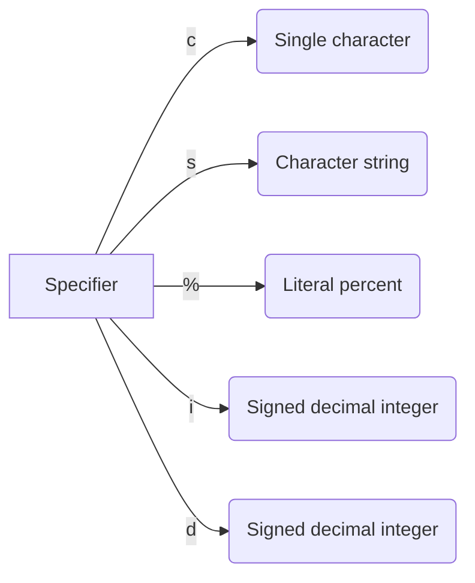

# Custom printf Function

This repository contains a "very small" custom `printf` function, named `_printf`, as part of a coding exercise.
The goal is to create a simplified version of the standard `printf` function in C.

## Requirements

The custom `_printf` function should follow these specifications:

* Prototype: `int _printf(const char *format, ...);`
* Return: The number of characters printed
    (excluding the null byte used to end output to strings).
* Write output to `stdout`, the standard output in terminal.
* The format string is composed of zero or more directives.
    See `man 3 printf` for more details.
* Handle the following conversion specifiers:
    `c`, `s`, `%` , `i` , `d`. (but 'd' and 'i' are the same for output).


_Here specifiers for the standard printf function._


<br>

* Do not reproduce the buffer handling of the C library `printf` function.
* Do not handle flag characters, field width, precision, or length modifiers.

## Usage

To use the custom `_printf` function, include the `main.h` header file in your C source files:
```c
#include "main.h"
```
Then, call the `_printf` function with the desired format string and arguments:
```c

* Here a simple example :
    An important point, for our exercice a main.c is generate automatically

int main(void)
{
    int a = -100;

    _printf("String: [%s]\n", "Hello, World!");
    _printf("Character: [%c]\n", 'A');
    _printf("Percent: [%%]\n");
    _printf("Decimal: [%d]\n", a);
    _printf("Integer: [%i]\n", 99);
    return 0;
}
```
## Compilation

To compile the custom `_printf` function, use the following command:
```sh
gcc -Wall -Werror -Wextra -pedantic -std=gnu89 -Wno-format *.c
```
This command compiles all the C source files in the current directory . The `-Wall`, `-Werror`, `-Wextra`, and `-pedantic` flags enable various compiler warnings and errors to ensure the code's quality and adherence to the C89 standard.

## Limitations

The custom `_printf` function provided in this repository has several limitations compared to the standard `printf` function:

* It only handles the `c`, `s`, `%`, `i` and `d` conversion specifiers.
* It does not support flag characters, field width, precision, or length modifiers.
* It may not have the same performance and buffer handling as the C library `printf` function.

Please refer to the standard `printf` function documentation for more information on its capabilities and usage.

**Made for the HOLBERTON SCHOOL - cohort THO-0224**
